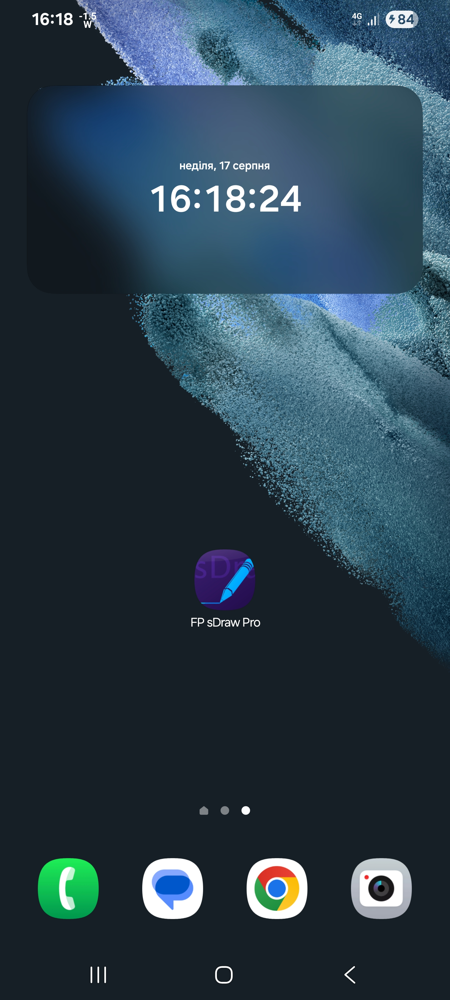
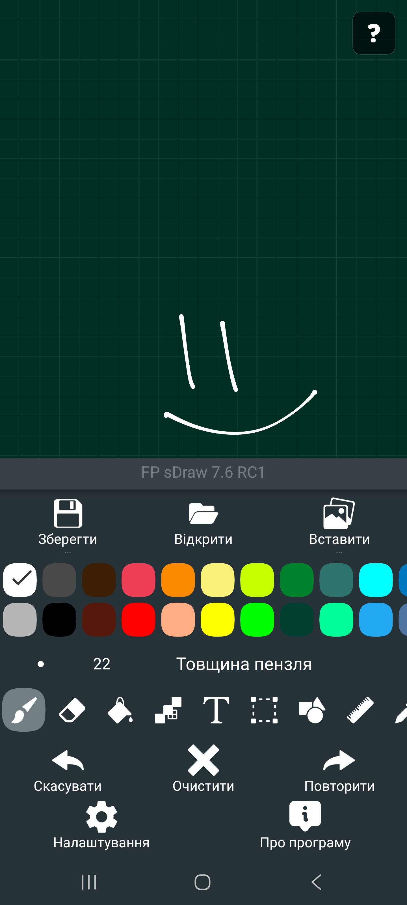
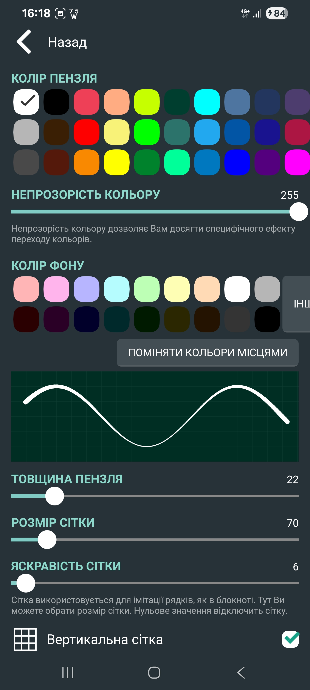
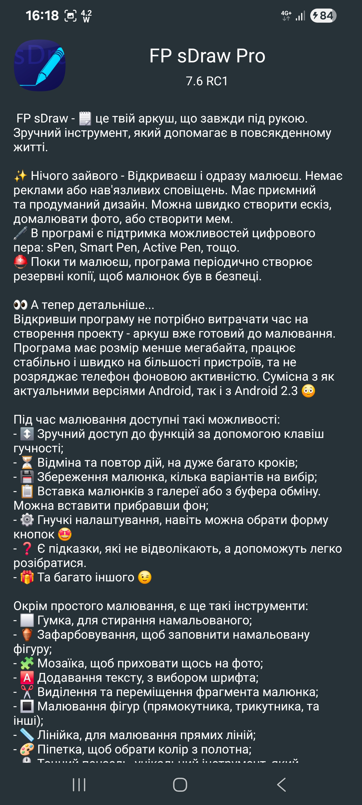

# FP-sDraw
This is an older version of the project, open for exploring, tweaking, and experimenting. The newer version is still private, so this is the perfect place to start your own experiments!  FP sDraw - Your Pocket Sketchpad! 🖌️ Lightweight, fast, and ad-free - open and start drawing instantly.

 {width=40%}
 {width=40%}
 {width=40%}
 {width=40%}

# FP sDraw

FP sDraw is a simple and lightweight drawing app — no ads, no clutter, just open and draw.  
✅ Designed for those who need a simple tool for simple tasks.

---

## Perfect for quick moments when you need to:
- 🎭 Create a meme or add text to a photo.
- 🧠 Sketch a diagram, note, or quick idea.
- 🖼️ Highlight or mark something directly on an image.
- 🎨 Experiment with different styles — lines, shapes, airbrush, text, and more.

---

## Why FP sDraw is worth having:
- 📦 Doesn’t take up space or run in the background.
- 🛑 No ads — nothing distracts you from drawing.
- 📉 Less than 1 MB — installs in seconds.
- ⚙️ No setup needed — starts instantly.
- 📱 Works even on very old phones.
- 🧩 Flexible UI — even the button shapes can be customized.
- ✍️ Stylus support: sPen, Active Pen, etc.
- 💡 Helpful tips appear only when needed.
- 🛟 Automatic backup keeps your sketches safe.
- 🔊 Volume buttons can trigger quick actions.

---

## Drawing tools:
- 🪄 Layers — organize complex sketches.
- 🖼️ Insert from gallery.
- 🖍 Brush and eraser.
- 🌬 Airbrush.
- 🏺 Fill.
- 🅰️ Text.
- ✂️ Selection.
- 🔳 Shapes.
- 📏 Ruler.
- 🎨 Eyedropper.
- 🧩 Mosaic.
- 🖱 Precision brush.

---

## Free vs Pro version

The free version is fully functional — no essential features locked.  

Pro version adds a few nice extras:
- 💛 Support the developer.
- 🖼️ Option to remove “sDraw” label from saved images.
- 🚫 Removes the message in the main menu.
- 🙅‍♂ No more “Buy Pro” reminders when saving.
- ⚡️ Projects from the free version are fully compatible with Pro.

---

🍞 Doesn’t eat resources or space — but always ready when needed 😊
